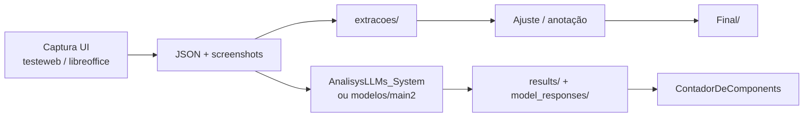

# ICLLMs

Repositório da iniciação científica sobre **extração de componentes de interface** e **avaliação de LLMs** como guias de usabilidade / próximo passo em tarefas.

O fluxo típico é:

1. Capturar a árvore de UI (web ou desktop) + screenshots  
2. Enviar imagem e/ou JSON para modelos (OpenRouter, Gemini, NVIDIA)  
3. Comparar respostas (guia, inventário de componentes, percurso cognitivo)  
4. Contar/analisar resultados e guardar datasets em `extracoes/` e `Final/`

Submódulo de aplicação web: [`AnalisysLLMs_System`](./AnalisysLLMs_System/) ([repo remoto](https://github.com/otbox/AnalisysLLMs_System)).

---

## Índice

- [Objetivo](#objetivo)
- [Estrutura do repositório](#estrutura-do-repositório)
- [Ambiente e dependências](#ambiente-e-dependências)
- [Especificações de captura](#especificações-de-captura)
- [Scripts Python (raiz e pastas)](#scripts-python-raiz-e-pastas)
- [Pasta `javascript/`](#pasta-javascript)
- [Dados: `extracoes/` e `Final/`](#dados-extracoes-e-final)
- [Submódulo `AnalisysLLMs_System`](#submódulo-analisysllms_system)
- [Pipeline sugerido](#pipeline-sugerido)

---

## Objetivo

Avaliar se LLMs multimodais conseguem, a partir de **screenshot** e/ou **JSON de estrutura UI**:

- inventariar componentes da tela;
- sugerir o **próximo passo** de uma tarefa do usuário;
- apoiar análise de usabilidade via **percurso cognitivo** (cognitive walkthrough).

Casos de estudo principais: **Americanas**, **Prefeitura de Limeira** e **LibreOffice Writer**.

---

## Estrutura do repositório

```
ICLLMs/
├── testeweb.py              # Extrator web (versão atual, CLI)
├── testeweb2.py             # Extrator web focado em menus hover (Americanas)
├── testewebOld.py           # Extrator web legado (Limeira / GoldenLayout)
├── requirementsLinux.txt    # Deps mínimas Linux (desktop UI parcial)
├── requirementsWindows.txt  # Deps Windows (pywinauto + pywin32)
├── .env                     # OPENROUTER_API_KEY (não versionar segredos)
├── .gitmodules              # Submódulo AnalisysLLMs_System
│
├── libreoffice/             # Extrator desktop Windows (LibreOffice)
├── modelos/                 # Scripts CLI de comparação multi-LLM (OpenRouter)
├── javascript/              # Experimento Puppeteer (stub)
├── extracoes/               # JSONs/screenshots brutos por site
├── Final/                   # Dataset final anotado / percursos (Americanas, Limeira, LO)
├── AnalisysLLMs_System/     # App Fastify + React para testes de LLMs
├── screenshots_ui/          # Pastas reservadas para capturas
└── screenshots_ui_completa/
```

---

## Ambiente e dependências

### Python (extração e contagem)

```bash
python -m venv venv
source venv/bin/activate   # Windows: venv\Scripts\activate

# LibreOffice / UI Windows:
pip install -r requirementsWindows.txt

# Linux (parcial — sem pywinauto):
pip install -r requirementsLinux.txt
```

Para os extratores web (`testeweb*.py`), instale também:

```bash
pip install selenium webdriver-manager
```

Chrome/Chromium precisa estar instalado no sistema.

### OpenRouter (scripts em `modelos/`)

Crie um `.env` na raiz:

```env
OPENROUTER_API_KEY=sua_chave
```

```bash
pip install openai python-dotenv
```

### Submódulo

```bash
git submodule update --init --recursive
```

Instruções de backend/frontend: [AnalisysLLMs_System/README.md](./AnalisysLLMs_System/README.md).

---

## Especificações de captura

| Item | Valor |
|------|--------|
| Resolução | 1920 × 1080 |
| LibreOffice | Windows |
| Americanas / Limeira | Garuda Linux |
| Navegador | Google Chrome / Chromium |

---

## Scripts Python (raiz e pastas)

### `testeweb.py` — extrator web atual (recomendado)

Extrai a árvore de componentes de páginas web (Americanas, Limeira e similares) com Selenium + Chrome.

**Destaques:**

- CLI com `--url`, `--out`, `--screens`
- Snapshot de elemento em um round-trip JS (posição, nome, visibilidade)
- Suporte a dropdowns customizados (Limeira), DIVs “botão” e menus hover (Americanas)
- Screenshots por elemento e JSON `{ "ui_structure": [ ... ] }`

```bash
python testeweb.py \
  --url "https://www.americanas.com.br/..." \
  --out extracoes/americanas/brinquedos/1b/estrutura_ui.json \
  --screens extracoes/americanas/brinquedos/1b/screenshots_ui
```

Defaults atuais apontam para a página de brinquedos da Americanas.

---

### `testeweb2.py` — variante Americanas (menus hover)

Versão mais enxuta, configurada por constantes no topo do arquivo (`URL`, `NOME_ARQUIVO_JSON`, `PASTA_SCREENS`).

Foco em triggers de hover (`MenuDesktop`, `department-nav`, etc.) e extração de itens de submenu. Menos genérica que `testeweb.py`; útil para páginas específicas da Americanas.

```bash
# Edite URL/caminhos no arquivo, depois:
python testeweb2.py
```

---

### `testewebOld.py` — legado (Limeira / GoldenLayout)

Versão anterior com lógica pesada para widgets Limeira (`temp05`, `temp06`, `btnMenuDinamico`, abas `lm_tab`). ChromeDriver com versão fixa. Preferir `testeweb.py` para novos runs; manter este script como referência histórica.

```bash
python testewebOld.py
```

---

### `libreoffice/teste.py` — extrator desktop Windows

Mapeia a árvore de UI do LibreOffice (ou outro `.exe`) via **pywinauto** (UI Automation).

**Classes principais:**

| Classe | Função |
|--------|--------|
| `BanlistConfig` | Ignora nomes/classes irrelevantes |
| `ExtractorConfig` | Path do app, threading, screenshots, profundidade |
| `UIExtractor` | Recursão, expansão de menus, screenshots, JSON |

**Saída:** `resultado_libreoffice_avancado.json` (+ pasta de imagens, ex.: `imgs_lo_avancado/`).

**Requisito:** Windows 10/11.

Detalhes de uso: [libreoffice/HOWUSE.md](./libreoffice/HOWUSE.md).

```bash
# No Windows, com LibreOffice instalado — ajuste app_path no ENTRY POINT:
python libreoffice/teste.py
```

---

### `modelos/main.py` — chat interativo OpenRouter (protótipo)

CLI simples: histórico de conversa + system prompt de “próximo passo”. Aceita texto/`file:`/`history`/`clear`/`exit`. Lista de modelos incompleta (placeholders). Útil como rascunho; para experimentos sérios use `main2.py` ou o submódulo.

```bash
cd modelos && python main.py
```

---

### `modelos/main2.py` — comparação multi-modelo

Envia o **mesmo prompt** (+ JSON de contexto opcional) a vários modelos OpenRouter em paralelo (`ThreadPoolExecutor`), salva `.txt` por modelo e um `*_summary.json` em `modelos/model_responses/`.

Modos:

- `interactive_comparison_with_context()` — interativo
- `exemplo_com_contexto()` — exemplo automático (paths hardcoded — ajustar antes de rodar)

```bash
cd modelos
# Edite o bloco if __name__ e caminhos do exemplo
python main2.py
```

Mais contexto: [modelos/README.md](./modelos/README.md).

---

### `extracoes/ContadorDeComponents.py`

Varre uma pasta de JSONs de **extração** (`ui_structure` + `filhos`) e gera `relatorio_componentes_ui_structure.json` com contagem recursiva de nós.

```bash
cd extracoes
# Ajuste build_folder_report("limeira") no __main__
python ContadorDeComponents.py
```

---

### `AnalisysLLMs_System/results/ContadorDeComponents.py`

Variante para **respostas de LLM**: conta componentes com `id` + `type` (formato inventário Gemini/OpenRouter), incluindo parse de `rawResponse` stringificado. Use sobre a pasta `results/`.

```bash
cd AnalisysLLMs_System/results
python ContadorDeComponents.py
```

---

## Pasta `javascript/`

Experimento com **Puppeteer** (`package.json`). `teste.js` está vazio — placeholder. A extração web de produção está nos scripts Python Selenium.

```bash
cd javascript && yarn install   # ou npm install
```

---

## Dados: `extracoes/` e `Final/`

### `extracoes/`

Material bruto/intermediário por domínio:

| Pasta | Conteúdo |
|-------|----------|
| `americanas/` | `estrutura_ui.json`, HTML reconstruído, dumps Wayback, relatórios |
| `limeira/` | Estruturas por página (cultura, notícias, transparência, etc.) |
| `libreoffice/` | Cópias do extrator + JSONs de resultado |

### `Final/`

Dataset consolidado para análise / paper:

| Pasta | Conteúdo |
|-------|----------|
| `Americanas/` | Passos nomeados (`1bNossaLoja`, `2v0a`, …) com `estrutura_ui.json` / `extraido.txt` / `adjusted_ui.json` |
| `Limeira/` | Idem para portal da prefeitura |
| `LibreOffice/` | Pares screenshot + texto/anotação por passo (`1v0a`, `2v1c`, …) |
| `ConfigModelo/` | Capturas de configuração de modelo |
| `libreoffice/` | Cópia auxiliar do extrator |

Há também `Final.zip` com empacotamento do dataset.

---

## Submódulo `AnalisysLLMs_System`

Aplicação para testar LLMs em cima de imagem (+ JSON opcional):

- **Backend:** Fastify + TypeScript (OpenRouter, Google Gemini, NVIDIA page-elements)
- **Frontend:** React + Vite — upload de screenshot, escolha de perfil/modelo, visualização de respostas
- **results/:** JSONs de execuções (Americanas, Limeira, LibreOffice, testes multi-LLM)

Documentação completa: **[AnalisysLLMs_System/README.md](./AnalisysLLMs_System/README.md)**.

Esquema de testes com imagens do `Final/` (número + versão do caso, versão do prompt Analysis, temperature no JSON/nome do arquivo): **[AnalisysLLMs_System/TESTING.md](./AnalisysLLMs_System/TESTING.md)**.

Perfis de prompt:

| Perfil | Função |
|--------|--------|
| `AnalisysComponentsLLM` | Inventário JSON de componentes |
| `GuideLLM` | Próximo passo / guia de ação |
| `CongnitiveWalktroughLLM` | Percurso cognitivo (usabilidade) |

---

## Pipeline sugerido



1. Extrair UI (`testeweb.py` ou `libreoffice/teste.py`)  
2. Revisar / ajustar JSON e screenshots  
3. Rodar análise no submódulo (UI) ou em `modelos/main2.py` (batch)  
4. Contar componentes e consolidar em `Final/`

---

## Licença e créditos

O submódulo `AnalisysLLMs_System` possui `LICENSE` própria. Scripts da raiz seguem o uso acadêmico do projeto IC.
